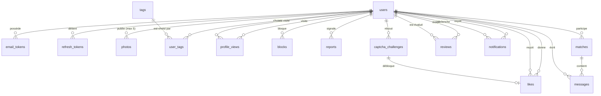

# Schéma de la base — Matcha

Vue relationnelle, sans SQL. Chaque table liste ses champs, leur rôle, et
l'exigence du sujet qui la justifie.

Base : **SQLite**. Nommage en `snake_case`, suppressions de compte en cascade sur
toutes les tables liées.

**Types** — SQLite n'a ni `uuid`, ni booléen, ni date, ni énumération :

| Dans ce document | En SQLite |
| --- | --- |
| uuid | `TEXT` (uuid v4) |
| booléen | `INTEGER` 0 / 1 |
| timestamp | `TEXT` ISO-8601 en UTC |
| décimal | `REAL` |
| enum | `TEXT` + contrainte `CHECK (x IN (...))` |

**Quatre pièges SQLite à connaître avant d'écrire la première requête :**

- **`PRAGMA foreign_keys = ON` à chaque connexion.** Désactivé par défaut : sans
  lui, les clés étrangères et les cascades ne s'appliquent **pas du tout**,
  silencieusement. C'est le piège classique.
- **`PRAGMA journal_mode = WAL`.** Par défaut, une écriture bloque toutes les
  lectures. Avec du chat et des notifications temps réel, on s'expose à des
  `database is locked`. Le mode WAL laisse lire pendant qu'on écrit.
- **Pas de `MATERIALIZED VIEW`.** La vue de popularité (§3) reste une vue simple.
  Si elle devient lente, il faudra une vraie table maintenue par triggers, pas un
  simple `REFRESH`.
- **Pas de fonctions trigonométriques garanties.** Le calcul de distance
  (haversine) se fait en JS, ou via une fonction personnalisée enregistrée par le
  driver — `better-sqlite3` le permet en une ligne.

---

## 1. Vue d'ensemble



---

## 2. Les tables

### `users`

Le cœur. Un seul enregistrement par personne.

| Champ | Type | Note |
| --- | --- | --- |
| `id` | uuid | |
| `email` | texte | **unique** |
| `username` | texte | **unique**, sert à la connexion (IV.1) |
| `first_name`, `last_name` | texte | modifiables à tout moment (IV.2) |
| `password_hash` | texte | **jamais** le mot de passe en clair — faille éliminatoire |
| `birth_date` | date | L'âge se calcule à la volée, on ne le stocke jamais : une colonne `age` serait fausse dès le lendemain de l'anniversaire. C'est ce champ qui rend possibles le tri, le filtre et la tranche d'âge de la recherche avancée (IV.3, IV.4). Prévoir le contrôle des 18 ans à l'inscription. |
| `gender` | enum | `woman`, `man`, `non_binary`, `other` |
| `orientation` | enum | `hetero`, `homo`, `bi`, `pan`, `other` — **défaut `bi`** si non renseigné (IV.3) |
| `biography` | texte | |
| `is_verified` | booléen | passe à vrai via le lien reçu par e-mail |
| `profile_completed` | booléen | genre + orientation + bio + ≥1 tag + ≥1 photo + localisation. Tant qu'il est faux, pas d'accès au matching |
| `latitude`, `longitude` | décimal | **la source de vérité.** Tout le tri par proximité se calcule dessus |
| `city`, `neighborhood` | texte | **dérivés** des coordonnées par géocodage inverse. Stockés quand même, pour ne pas rappeler l'API à chaque affichage et rester lisibles si elle tombe |
| `location_consent` | booléen | consentement explicite au suivi GPS (RGPD, note IV.2) |
| `is_online` | booléen | **plus utilisé** — voir ci-dessous. Conservé pour ne pas migrer la table ; ne jamais le lire |
| `last_seen_at` | timestamp | rafraîchi par le battement de cœur — c'est la « date et heure de dernière connexion » exigée en IV.5, **et** la seule source de l'état en ligne |
| `created_at` | timestamp | |

**L'état en ligne est calculé à la lecture, à partir de `last_seen_at`.** Une
page ouverte envoie un `POST /api/presence` toutes les 30 secondes, qui remet
`last_seen_at` à l'heure. « En ligne » signifie « vu il y a moins de
`PRESENCE_WINDOW_SECONDS` » (90 s), exprimé par la fonction `onlineNow()` de
`schema/views.ts` — la même mécanique que `ageYears()`, qu'on ne stocke pas non
plus.

**Révision d'une décision antérieure.** Ce document prévoyait de piloter
`is_online` par les **webhooks de présence** Pusher, en écartant le seuil
d'inactivité comme « moins juste ». C'était impraticable : un webhook part des
serveurs de Pusher vers l'application, et ils ne peuvent pas joindre
`http://localhost:3000` — `localhost` désigne la machine qui résout le nom, donc
la leur. Or l'application tourne sur `localhost` en développement **comme à la
soutenance**. Il aurait fallu un tunnel (ngrok), dont l'URL change à chaque
redémarrage en version gratuite, pour une exigence sur laquelle le sujet
n'impose **aucun délai** — les 10 secondes concernent le chat (IV.6) et les
notifications (IV.7), pas la présence.

Le prix de ce choix est assumé : quelqu'un qui ferme son onglet reste affiché en
ligne pendant au plus 90 secondes. En échange, la fonctionnalité ne dépend
d'aucun service tiers et ne peut pas tomber en panne devant le correcteur.

**Une seule source de vérité, délibérément.** `is_online` n'est plus écrit ni
lu : une colonne dénormalisée que rien ne remet à zéro resterait à `true` pour
l'éternité dès la première déconnexion brutale. C'est exactement le défaut que
la §3 reproche aux notes de popularité stockées. Toute requête qui expose l'état
en ligne doit passer par `onlineNow()` — y compris le futur feed, dont le
`SELECT candidate.*` récupère sinon la colonne périmée.

### `email_tokens`

Vérification de compte **et** réinitialisation de mot de passe (IV.1).

| Champ | Type | Note |
| --- | --- | --- |
| `id`, `user_id` | uuid | |
| `token_hash` | texte | on stocke le **hash**, pas le jeton : une fuite de base ne doit pas permettre de prendre des comptes |
| `type` | enum | `email_verification` / `password_reset` |
| `expires_at` | timestamp | |
| `used_at` | timestamp | usage unique |

### `refresh_tokens`

Authentification en deux jetons : un **access token** court (~15 min, jamais
stocké, vérifié par signature) et un **refresh token** long, lui bien stocké —
c'est ce qui permet de le **révoquer**.

| Champ | Type | Note |
| --- | --- | --- |
| `id`, `user_id` | uuid | |
| `token_hash` | texte | jamais le jeton en clair |
| `expires_at` | timestamp | |
| `revoked_at` | timestamp | déconnexion |
| `created_at` | timestamp | |

C'est cette table qui rend possible la **déconnexion en un clic depuis n'importe
quelle page** exigée en IV.1 : on révoque la ligne. Avec des JWT seuls, sans rien
en base, « se déconnecter » ne veut rien dire côté serveur — le jeton reste
valide jusqu'à expiration.

### `photos`

| Champ | Type | Note |
| --- | --- | --- |
| `id`, `user_id` | uuid | |
| `path` | texte | le fichier sur disque, jamais le binaire en base |
| `is_profile` | booléen | **une seule à vrai par utilisateur** |
| `position` | entier | ordre d'affichage |

Deux règles à faire respecter par la base : **5 photos maximum** et **une seule
photo de profil**. Sans photo de profil, l'utilisateur ne peut pas liker (IV.5) —
la contrainte rend la vérification triviale.

### `tags` et `user_tags`

`tags` : `id` · `label` (unique, ex. `vegan`) — pré-remplie avec la liste du §7.
`user_tags` : `user_id` + `tag_id`, clé primaire composée.

Une table plutôt qu'un enum, parce que le sujet veut des tags **réutilisables**
(IV.2) : un enum imposerait une migration à chaque ajout. Et c'est la table de
liaison qui permet de compter les **tags communs** en SQL, donc de trier et
filtrer dessus (IV.3, IV.4).

### `profile_views`

`id` · `viewer_id` · `viewed_id` · `viewed_at`

Historique complet, **pas** de contrainte d'unicité : le sujet parle d'un
historique de visites (IV.5), donc plusieurs visites du même profil comptent.
Alimente « qui a consulté mon profil » (IV.2) et la notification `VIEWED`.

### `likes`

`liker_id` + `liked_id` en clé primaire composée · `liked_at`

Un seul like actif par paire. **Le unlike supprime la ligne**, ce qui coupe le
match et le chat, comme exigé en IV.5.

### `matches`

`id` · `user_a_id` · `user_b_id` · `connected_at` · `is_active`

Dérivable de `likes` (deux lignes croisées), mais une table explicite évite une
jointure lourde à chaque chargement de page et donne un point d'accroche aux
messages. Ranger `user_a_id` et `user_b_id` toujours dans le même ordre pour
éviter les doublons.

Sur un unlike, passer `is_active` à faux plutôt que supprimer : sinon
l'historique de conversation disparaît, et on perd de quoi émettre la
notification `UNLIKED`.

### `messages`

`id` · `match_id` · `sender_id` · `body` · `sent_at` · `read_at`

Rattachés au **match**, pas à un couple d'utilisateurs. `read_at` à nul donne
directement le badge « nouveau message » visible depuis n'importe quelle page
(IV.6).

### `reviews`

Note + commentaire laissés par un utilisateur sur un autre, façon Airbnb.
Alimente la note de popularité (§3).

| Champ | Type | Note |
| --- | --- | --- |
| `id` | uuid | |
| `author_id` | uuid | qui évalue |
| `target_id` | uuid | qui est évalué |
| `score` | entier | 1 à 5, **contraint en base** |
| `body` | texte | commentaire, facultatif |
| `created_at`, `updated_at` | timestamp | modifiable, d'où `updated_at` |

Contraintes indispensables :

- **unicité sur (`author_id`, `target_id`)** — un avis par personne, modifiable ;
  sinon on empile les notes pour faire couler quelqu'un ;
- **`author_id` ≠ `target_id`** — pas d'auto-évaluation ;
- **réservé aux profils connectés** — n'autoriser l'avis que s'il existe un
  match. Sans ça, n'importe qui note n'importe qui sans l'avoir rencontré, la
  note ne veut plus rien dire, et on ouvre la porte aux avis groupés.

Deux points de vigilance :

- **`body` est du contenu utilisateur affiché publiquement** : porte d'entrée
  directe à l'injection HTML/JS, explicitement listée comme faille éliminatoire.
  Échappement à l'affichage, jamais de `dangerouslySetInnerHTML`.
- **Prévoir le signalement d'un avis**, ou au minimum sa suppression. Un
  commentaire libre sur un site de rencontre est un vecteur de harcèlement. Le
  motif `harassment` de `reports` peut servir, avec un `target_review_id`
  facultatif.

Un avis émis par un utilisateur bloqué ne s'affiche plus et ne compte plus dans
la note.

### `captcha_challenges`

Pour liker, il faut d'abord résoudre un captcha tiré au sort (§4). Une ligne par
tentative.

| Champ | Type | Note |
| --- | --- | --- |
| `id` | uuid | |
| `user_id` | uuid | celui qui doit résoudre — pris **de la session**, jamais du corps de la requête |
| `target_id` | uuid | le profil qu'il veut liker |
| `type` | texte | le slug du captcha tiré au sort — voir §4 |
| `state` | texte (JSON) | l'état propre au captcha tiré : sa solution et sa progression |
| `attempts` | entier | nombre de tentatives reçues |
| `last_submit_at` | timestamp | anti-bourrinage : refuse ce qui arrive trop vite |
| `last_submit_hash` | texte | empreinte de la dernière tentative — deux envois identiques au bit près trahissent un rejeu |
| `status` | enum | `pending` / `solved` / `failed`. Une réponse fausse fait passer à `failed` **définitivement** — cf. §4 |
| `solved_at` | timestamp | |
| `consumed_at` | timestamp | mis à l'heure quand le like est enregistré — **usage unique** |
| `created_at`, `expires_at` | timestamp | |

**`state` est en JSON, et c'est volontaire.** Chaque captcha a un état
différent : une progression et une solution qui n'ont rien à voir d'un module à
l'autre. Une colonne par type donnerait une table pleine de colonnes nulles, et
une migration à chaque captcha ajouté. Le serveur reste seul
à lire et écrire ce champ — il n'est jamais renvoyé brut au client, sinon on lui
donnerait la réponse.

**`target_id` est la contrainte qui compte.** Sans elle, on résout un captcha
une fois et on le rejoue sur tous les profils. Le challenge est lié au couple
(qui like, qui est liké), et `consumed_at` garantit qu'il ne sert qu'une fois.

`user_id` vient de la session, jamais du corps de la requête — sinon on résout
un captcha au nom de quelqu'un d'autre.

Prévoir un plafond de challenges créés par utilisateur et par heure : sans ça,
on ouvre mille challenges jusqu'à tomber sur le captcha le plus facile.

### `blocks`

`blocker_id` + `blocked_id` en clé primaire composée · `blocked_at`

À exclure de **toutes** les requêtes : suggestions, recherche, notifications,
chat (IV.5).

### `reports`

`id` · `reporter_id` · `reported_id` · `reason` (enum) · `reported_at`

Unicité sur (`reporter_id`, `reported_id`) pour éviter le spam de signalements.
Motifs : `fake_account`, `harassment`, `scam`, `inappropriate_behavior`,
`inappropriate_content`, `identity_theft`. Le sujet n'exige que « faux compte »,
le reste est du bonus.

### `notifications`

| Champ | Type | Note |
| --- | --- | --- |
| `id` | uuid | |
| `recipient_id` | uuid | qui la reçoit |
| `actor_id` | uuid | qui l'a déclenchée |
| `type` | enum | `LIKED`, `VIEWED`, `MESSAGE`, `MATCH`, `UNLIKED` — les 5 du sujet, ni plus ni moins |
| `link` | texte | |
| `created_at`, `read_at` | timestamp | `read_at` nul = non lue, pour le badge global (IV.7) |

---

## 3. La note de popularité

Le sujet laisse libre, à condition que les critères soient **cohérents et
défendables en soutenance** (note 1, IV.2). Ici la note combine deux sources.

### La moyenne des avis, corrigée

Prendre la moyenne brute de `reviews.score` a un défaut fatal : **un seul avis à
5/5 donne une note parfaite**, devant quelqu'un qui a quarante avis à 4,8. Et un
nouvel inscrit sans aucun avis tombe à 0, donc enterré dans les suggestions pour
toujours.

La correction classique — celle d'IMDb et des plateformes d'avis — est la
**moyenne bayésienne** : on part d'une note neutre, que les avis déplacent
d'autant plus qu'ils sont nombreux.

```
note_corrigée = (C × m + somme_des_notes) / (C + nombre_d_avis)

  m = moyenne globale du site (la valeur d'un profil sans avis)
  C = nombre d'avis à partir duquel on fait vraiment confiance (5 à 10)
```

Un profil sans avis vaut exactement `m`, ni avantagé ni pénalisé. Un profil à
5/5 sur un seul avis converge lentement vers 5 au lieu d'y sauter d'un coup.

### L'engagement

Les avis seront rares au début — sur 500 profils générés, quasi inexistants. Il
faut donc une seconde composante, toujours disponible :

| Composante | Idée |
| --- | --- |
| Ratio likes reçus / vues reçues | distingue « vu par beaucoup » de « plaît à beaucoup » |
| Matchs | un like réciproque vaut plus qu'un like simple |
| Complétude du profil | récompense les profils remplis |
| Signalements | malus |

### La combinaison

```
popularité = 60 % × note_corrigée_ramenée_sur_100
           + 40 % × score_d_engagement
           − pénalité_signalements
```

Borné à 0-100. Les pondérations sont libres — l'important est de pouvoir les
**justifier** et qu'elles soient les mêmes pour tout le monde.

### Stockage : aucun

Rien de tout ça n'est stocké sur `users`. La note se calcule dans une **vue SQL**
qui agrège `reviews`, `likes`, `profile_views` et `reports`.

C'est un choix délibéré. Dénormaliser (`rating_avg`, `rating_count`,
`popularity_score` en colonnes) obligerait à recalculer à chaque avis, like,
unlike, vue et signalement — et le jour où on oublie un de ces points d'appel,
la note affichée est fausse sans que rien ne le signale. Le sujet exige que la
note soit **cohérente** ; une valeur dérivée qui dérive de sa source est
exactement ce qu'on ne veut pas.

À 500 profils, l'agrégation est de l'ordre de la milliseconde : la vue se trie et
se filtre comme une table ordinaire, ce qui couvre les exigences IV.3 et IV.4.

**Si ça devient lent** — et seulement à ce moment-là — il faudra une vraie table
alimentée par des triggers, SQLite n'ayant pas de vue matérialisée. Les requêtes
qui l'utilisent ne changeront pas pour autant : elles liront une table au lieu
d'une vue, sous le même nom.

---

## 4. Le captcha du like

C'est la fantaisie du projet : on ne like pas en un clic. À chaque like, un
captcha est **tiré au sort** dans un catalogue, chacun avec son nom et sa
rareté.

Cette section décrit la mécanique commune — le tirage, l'état, le jeton. Les
captchas eux-mêmes sont des modules interchangeables : ce qu'ils demandent à
l'utilisateur ne regarde qu'eux.

## 6. Index à prévoir

Le sujet impose **500 profils minimum**, et le tri/filtre s'applique à la liste
entière. Sans index, la recherche multicritère devient injouable.

- `users` : `email`, `username` (uniques) ; `birth_date`, `is_online`, `last_seen_at` ;
  un index géographique sur `(latitude, longitude)`
- `user_tags` : sur `tag_id`, pour trouver qui partage un tag
- `profile_views` : sur `viewed_id` — c'est cette colonne que la vue de
  popularité agrège
- `likes` : sur `liked_id`, même raison
- `reviews` : sur `target_id`, même raison
- `messages` : sur `(match_id, sent_at)`
- `notifications` : sur `(recipient_id, read_at)`
- `refresh_tokens` : sur `token_hash`
- `captcha_challenges` : sur `(user_id, target_id, status)`

---

## 7. Liste des tags

À insérer dans `tags`.

**Alimentation** — vegan, vegetarian, foodie, cooking, baking, coffee, tea, wine, cocktails, brunch

**Voyage & plein air** — travel, backpacking, roadtrip, beach, mountains, nature, hiking, camping

**Sport** — fitness, running, cycling, yoga, pilates, swimming, surfing, skiing, dancing, football, basketball, tennis, climbing

**Animaux** — pets, dogs, cats, horses

**Musique** — music, concerts, liveMusic, singing, guitar, piano

**Écrans & lecture** — movies, horrorMovies, comedy, tvSeries, anime, manga, books, reading, podcasts

**Jeux** — gaming, esports, boardGames, puzzles

**Sciences & technique** — technology, programming, science, space

**Art & style** — photography, art, painting, fashion, streetwear, tattoos, piercing, vintage

**Développement personnel** — meditation, mindfulness, spirituality, selfDevelopment

**Engagement** — volunteering, sustainability, activism

**Savoirs** — languages, history, education, entrepreneurship, business

**Sorties** — nightlife, parties, festivals, museums, theatre, standUp, karaoke

**Maison & mécanique** — gardening, diy, cars, motorcycles, finance

**Traits & intentions** — familyOriented, introvert, extrovert, adventurous, spontaneous, openMinded, lgbtqFriendly, casualDating, seriousRelationship, longTermRelationship, oneShotRelationship

---

## 8. Hors schéma, à ne pas oublier

- **Mots de passe** : les mots anglais courants sont refusés (IV.1). La liste
  filtrée reste **hors base**, dans
  [`frequent-english-words.csv`](../frequent-english-words.csv) — 15 897 mots.
  À charger **une fois au démarrage** dans un `Set` en mémoire : vérification
  instantanée, sans requête. Ne pas relire le fichier à chaque inscription, ce
  serait 15 897 lignes parsées par formulaire.
- **500 profils** minimum en base pour la soutenance (instructions générales).
- **Identifiants et clés** dans `.env`, exclus de git — le stockage public peut
  faire échouer le projet.
